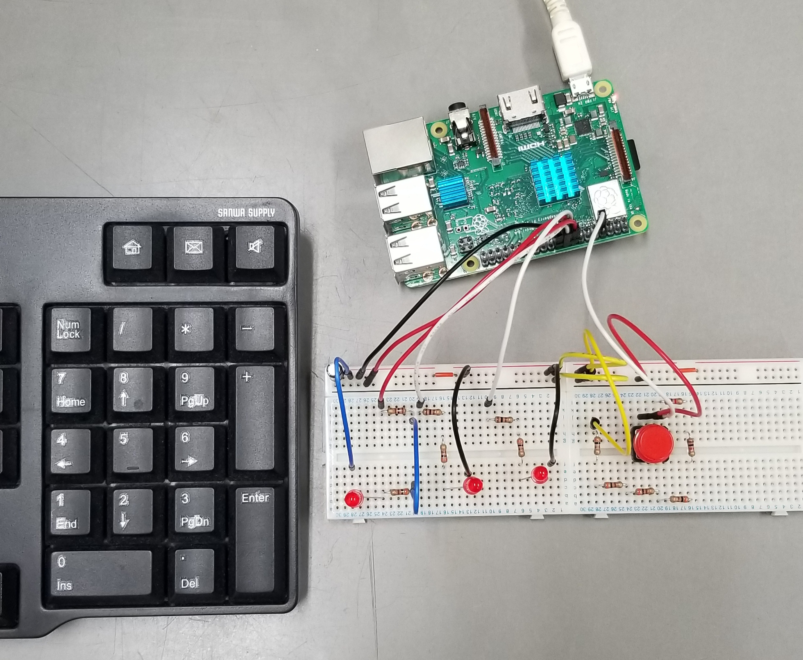
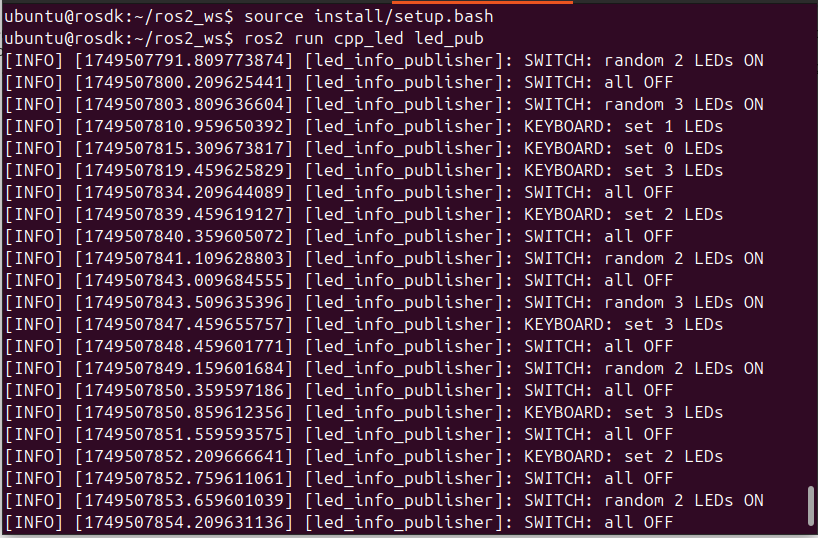
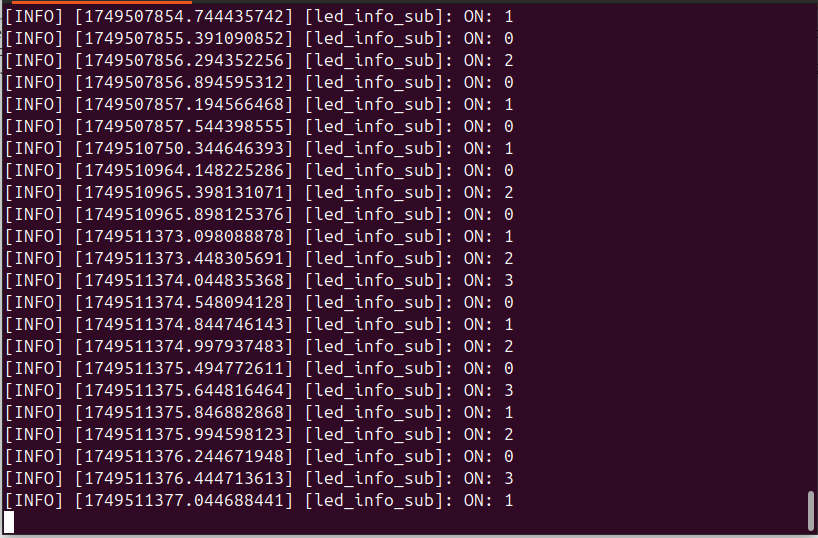
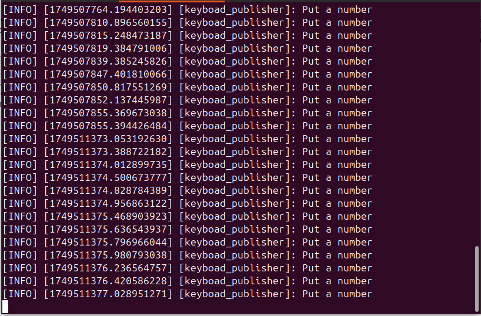

# ROS2とRaspberry PiのGPIOピンを用いてLEDをチカチカさせる
用いたものはLED3つ、タクタイルスイッチ1つ、Raspberry Pi 3 model B+、必要な分の抵抗とコンデンサーである。
以下の画像は実際に回路を作っている様子である。見えづらいがLEDはラズパイのGPIOピンに抵抗を介して接続されている。

<div align="center">

</div>

スイッチを押すことで3つのLEDがランダムに点灯する。
そして、点灯しているLED数をトピックにパブリッシュする。
それを受け取ることで、現在何個のLEDが点灯しているかターミナル上で見ることが出来る。
また、キーボードの数字0～3までのキーを押すことで、押されたキーの情報がパブリッシュされる。
そして、それを受け取ったLEDを点灯させるノードが押されたキーの数字に対応して任意の個数のLEDを点灯させる。
その情報もパブリッシュされているので、何個のLEDが点灯しているかをターミナル上で見ることが出来る。

## 実行方法について
led_pub.cppだけはラズパイ上で実行する必要があるが、今回はラズパイとPCをssh接続して実行したためled_sub.cppとled_key.cppのノードに関しては他のPCでも実行可能である。
他のPCも使用する場合は以下のコマンドをそれぞれのノードを実行するターミナルで実行する。10という数字は変更可能である。
```bash
export ROS_DOMAIN_ID=10
```
```bash
source /opt/ros/jazzy/setup.bash
```
ビルドする。PCを使用する場合はPCでもビルドする。また、ラズパイのCPUのアーキテクチャとIntelなどのアーキテクチャは作りが異なるらしいので
クロスコンパイルするか、ラズパイ上でビルドする。今回はクロスコンパイルが手間がかかりそうだったのでラズパイ上でビルドした。
```bash
colcon build --packages-select cpp_led
```
もし、これはラズパイ3 B+だけかもしれないが、メモリ不足でビルド出来ないことがあった。そのときはスワップメモリを増設して対応した。

ビルドが完了したら、以下のコマンドを実行する。
```bash
source install/setup.bash
```
```bash
#ラズパイ上でled_pub.cppを実行する
ros2 run cpp_led led_pub
```
```bash
#ラズパイ上またはPC上でled_sub.cppを実行する
ros2 run cpp_led led_sub
```
```bash
#ラズパイ上またはPC上でled_key.cppを実行する
ros2 run cpp_led led_key
```
## 実行の様子
実行してボタンを押すとランダムな個数分LEDが点灯する。また、その情報を受けとり表示させることが出来る。
キーボードの0〜3の数字を押すと任意の個数のLEDを点灯させることが出来る。
以下が実行の様子である。

1つ目はled_pubのターミナルの画像。点灯させて、パブリッシュしている情報を表示させている。
<div align="center">

</div>

2つ目はled_subのターミナルの画像。点灯しているLEDの数を表示させている。
<div align="center">

</div>

3つ目はled_keyのターミナルの画像。ボタンを押すように促している。
<div align="center">

</div>

最後に動作しているところをGIFにて示す。
<div align="center">
  
</div>
